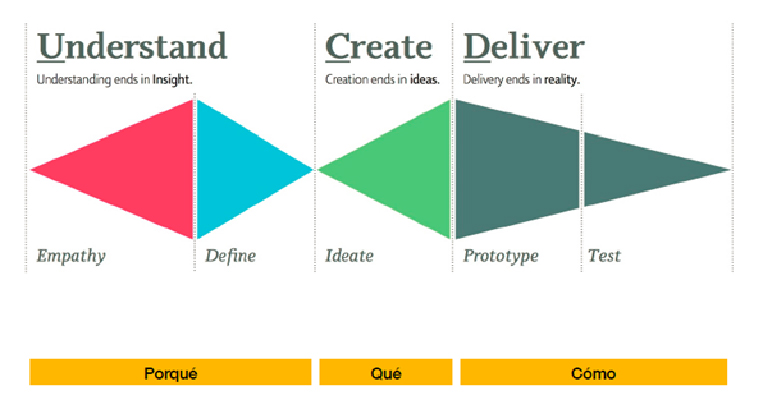
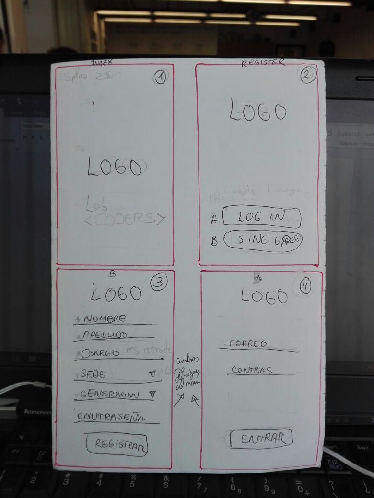
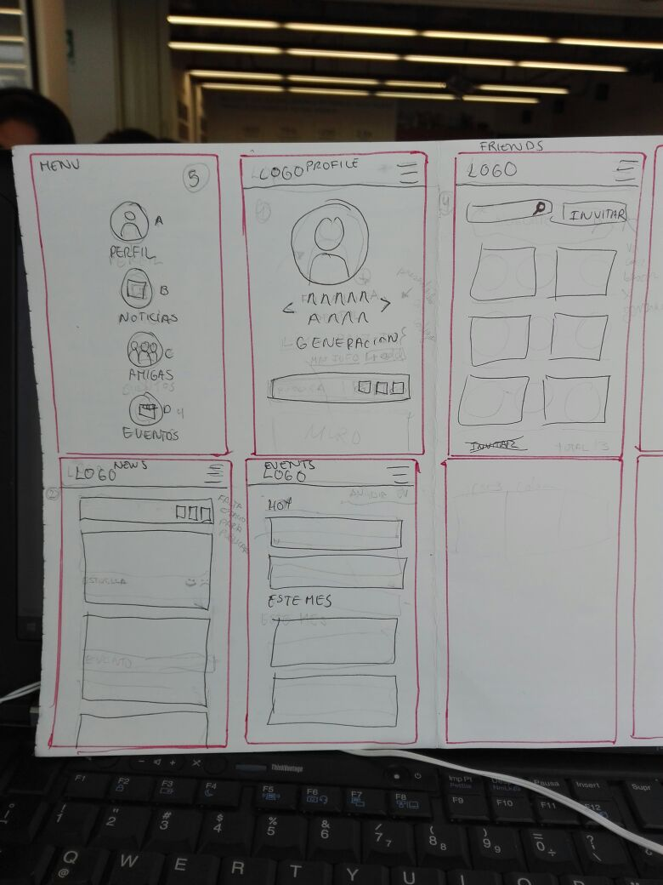

# CREA TU PROPIA RED SOCIAL
Crear una red social puede resultar ser un proyecto muy sencillo o muy complicado, todo depende de tener las ideas claras y los recursos necesarios.

## Ideas claras:
Gracia a la grata visita de Mariana a Laboratoria el pasado viernes donde nos comentó que el número de egresadas era con el pasar del tiempo más y más grande se nos ocurrió hacer una red de egresadas, pues muchas de ellas ya no tienen comunicación entre si, con el fluir de las ideas pensamos en incluir a ex alumnas que por diversos motivos no pudieron continuar en Laboratoria, pero las cuales desean seguir en comunicación con gente tan chévere que conocieron en esta etapa.
Es así que nace Lab Code una red social que tendrá como usuarias a todas aquellas chicas que añoran la experiencia Laboratoria.

### Debíamos hacernos algunas preguntas:
* **¿Por qué la gente debe usar esta red social en vez de Facebook?**
Encontramos el elemento diferenciador del proyecto (la red social la usarían chicas que comparten la misma experiencia, lo cual las haría más cercanas). Las redes y juegos sociales que han tenido éxito son las que han demostrado a sus usuarios que pueden compartir un interés común.

* **¿Esta red puede alcanzar una masa crítica de usuarios?**
Una red social sin actividad no sirve para nada, y para tener actividad necesitas un número suficiente de usuarios que quieran comunicarse entre sí. Como esta dicho líneas arriba cada día somos más y esto incrementaría esta red.

* **¿Cómo vamos a conseguir usuarios?**
Quizás tu público sea el adecuado pero la gente tiene que saber que existes. Una buena forma de comunicación seria la misma Laboratoria pues mantiene el contacto con la mayoría de egresadas y en otra gran parte las ex estudiantes quienes querrán tener contacto con más gente como ellas.

* **¿Qué tecnología vamos a emplear?**
Laboratoria nos ha dado a conocer grandes herramientas entre las cuales usaremos: HTML, CSS, BOOTSTRAP, JQUERY, FIREBASE.

## Proceso UX

### Descubrimiento e investigación:
Empezamos con el primer proceso de encuestas para poder descubrir que problemas podríamos solucionar para ellas.
Egresadas:
1. Que es lo que más extrañas de laboratoria?
2. Te gustaría tener más contacto con tus ex compañeras?
3. Que cosas crees que puedas compartir con chicas de otras generaciones?
4. Que te hubiese gustado que suceda mientras participaste en Laboratoria?
5. Si te informan sobre una red social para chicas que participaron en Laboratoria, que es lo primero que pensarías?
6. Qué te gustaría ver en esta red social?
7. Qué postearías en esta red social.
8. Que te interesaría ver en esta red social.

Ex alumnas:
1. Extrañas algo sobre tu participación en Laboratoria?
2. Qué momentos destacarías?
3. Que te hubiese gustado que suceda mientras participaste en Laboratoria?
4. Si te informan sobre una red social para chicas que participaron en Laboratoria, que es lo primero que pensarías?
5. Qué te gustaría ver en esta red social?
6. Qué postearías en esta red social.
7. Que te interesaría ver a ti en esta red social.

### Síntesis y definición:
En base a las respuestas de egresadas y ex alumnas hemos podido concluir que en su totalidad extrañan el tiempo que pasaban con sus amigas y que de haber una red les encantaría compartir código, temas nuevos, memes y sobre todo eventos.

### Ideación:
Esta red social debería de tener además de lo solicitado (perfil, amigos, sección de post etc) una sección de eventos pues una gran mayoría de chicas puso que le interesaría ese tema.

### Prototipado:

